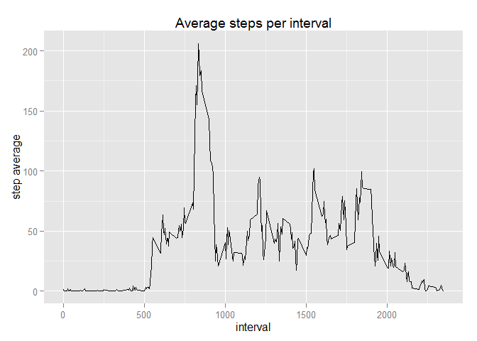
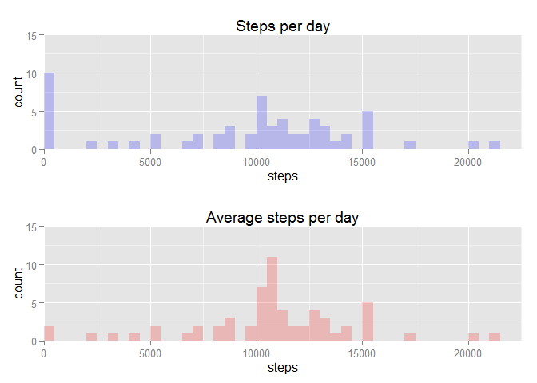
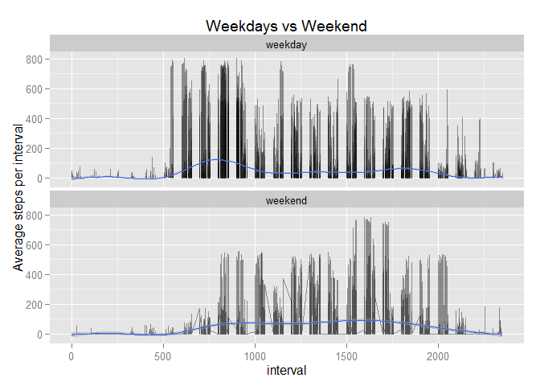

# Reproducible Research: Peer Assessment 1


```
## Loading required package: grid
```

## Loading and preprocessing the data
The input file is downloaded automatically only if an existing copy is unavailable, and assumed to be static and independent of the download date/time. This eliminates the need to keep timestamped versions of the data for every run. Only csv files are kept with all other intermediate (i.e. zip files) discarded immediately.

```r
ZIPFILE <- "data.zip"
RAWFILE <- "activity.csv"
FILEURL <- "https://d396qusza40orc.cloudfront.net/repdata%2Fdata%2Factivity.zip"
if (! file.exists(RAWFILE)) {
  download.file(url = FILEURL, destfile = ZIPFILE)
  unzip(ZIPFILE)
  file.remove(ZIPFILE)
}
DATA <- read.csv(RAWFILE)
```

## What is mean total number of steps taken per day?
First we build summary with the total number of steps for each recorded date, ignoring NA values; then plot using ggplot2 to build the required histogram

```r
SUMD <- ddply(DATA, .(date), summarise, steps = sum(steps, na.rm = T))
COORD <- coord_cartesian(xlim = c(0, 22500), ylim = c(0, 15))
p0 <- ggplot(data = SUMD) + 
  geom_histogram(aes(x = steps), fill = "blue", alpha = 0.2, binwidth = 500) +
  ggtitle("Steps per day") + 
  xlab("steps") +
  COORD
grid.arrange(p0, ncol = 1)
```

 

The mean and median are ``9354.2295082`` and ``10395`` respectively

## What is the average daily activity pattern?
For the average daily pattern we proceed similarly as before indexing by interval instead of date. We then plot in the same way we proceeded before 

```r
SUMI <- ddply(DATA, .(interval), summarise, steps = mean(steps, na.rm = T))
ggplot(data = SUMI, aes(interval, steps)) + 
  geom_line() +
  ggtitle("Average steps per interval") +
  xlab("interval") +
  ylab("step average")
```

 

The interval with the highest average is ``835``

## Imputing missing values

We can easily find the number of missing values to be ``2304`` out of ``17568``. The original mean was calculated to be ``37.3825996`` with median ``0``, we'll use this value and implement a simple constant imputation strategy


```r
omean <- mean(DATA$steps[! is.na(DATA$steps)])
fillfn <- function(steps, date, interval) { ifelse(is.na(steps), omean, steps) }
FDATA <- mdply(DATA, fillfn) %>% mutate(steps = V1)
```
 
Given our choice for the imputation strategy the overall mean value  has not been alterd as is still ``37.3825996``. The median also stays the same at value ``0`` . Plotting histograms for the original and imputed data sets we get:


```r
SUMF <- ddply(FDATA, .(date), summarise, steps = sum(steps, na.rm = T))
SUMS <- merge(SUMD, SUMF, by = "date") %>% 
  mutate(steps.d = steps.y - steps.x)
p1 <- ggplot(data = SUMS, aes(x = steps.y)) +
  geom_histogram(aes(x = steps.y), fill = "red", alpha = 0.2, binwidth = 500) +
  ggtitle("Average steps per day") + 
  xlab("steps") +
  COORD
grid.arrange(p0, p1, ncol = 1)
```

 

As we can see our imputation strategy has a significant effect witht the number of days with low or zero step count has decreased and the days with mean step count has increased in approximately the same proportion.

Turns out there's a lot that goes into devising an effective imputing strategy for misisng data. If interested check out [Amelia II](http://gking.harvard.edu/amelia) and the referenced [paper](http://www.math.smith.edu/~nhorton/muchado.pdf) and [video](https://vimeo.com/18534025) from their project page.

## Are there any differences between 
We first create the factor variable 'is.weekday' as requred  


```r
WEDAYS = c('Saturday', 'Sunday')
IS.WEDAY <- function(x) { ifelse(weekdays(as.Date(x)) %in% WEDAYS, "weekend", "weekday") }
DATAW <- DATA %>% mutate(is.weekday = factor(IS.WEDAY(date)))
SUMW <- ddply(DATAW, .(interval, is.weekday), summarise, steps = mean(steps, na.rm = T))
```

Plotting is then straightforward  


```r
ggplot(DATAW, aes(x = interval, y = steps)) +
  geom_line(alpha = 0.4) +
  geom_smooth(alha = 0.2) +
  facet_wrap(~ is.weekday, ncol = 1) +
  xlab("interval") +
  ylab("Average steps per interval") +
  ggtitle("Weekdays vs Weekend")
```

 

We can observe from the graph that the average weekday activity starts earlier and is much more variable throughout the day with a noticeable peak in the morning hours. Weekend behavior on the other hand is somewhat smoother with a less pronunced peak in the afternoon hours. It's somewhat odd to notice that late night activity seems to be lower during weekends, whereas a naive expectation would be the opposite to happen; could this be perhaps an artifact of sampling bias?, or simply people sitting at pubs?
