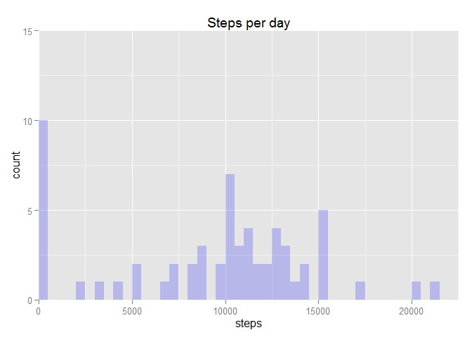
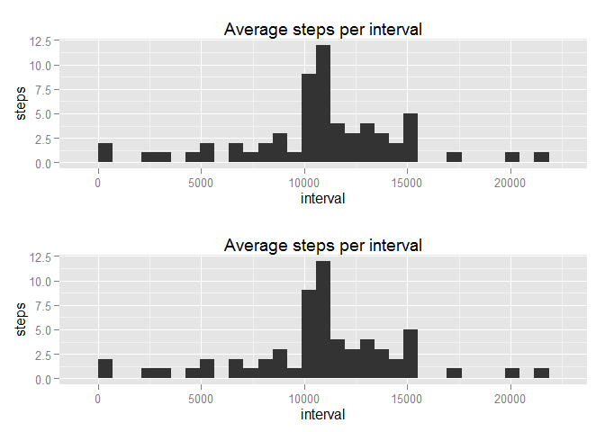

# Reproducible Research: Peer Assessment 1


## Loading and preprocessing the data
File is downloaded automatically only if an existing copy is unavailable, and assumed to be static and independent of the download date/time. This eliminates the need to keep timestamped versions of the data for every run. Only csv files are kept with all other intermediate (i.e. zip files) discarded immediately.

```r
ZIPFILE <- "data.zip"
RAWFILE <- "activity.csv"
FILEURL <- "https://d396qusza40orc.cloudfront.net/repdata%2Fdata%2Factivity.zip"
if (! file.exists(RAWFILE)) {
  download.file(url = FILEURL, destfile = ZIPFILE, method = if(Sys.info()['sysname'] == "Linux") "wget" else "internal")
  unzip(ZIPFILE)
  file.remove(ZIPFILE)
}
DATA <- read.csv(RAWFILE)
```

## What is mean total number of steps taken per day?
First we build summary with the total number of steps for each recorded date, ignoring NAs

```r
library(ggplot2)
library(functional)
SUM <- tapply(DATA$steps, DATA$date, Curry(sum, na.rm = T))
```
Then plot using ggplot2 to build the required histogram 

```r
qplot(SUM, geom = "histogram") + 
  ggtitle("Steps per day") + 
  xlab("steps")
```

 

The Mean is

```r
mean(SUM, na.rm = T)
```

```
## [1] 9354.23
```
and Median is 

```r
median(SUM, na.rm = T)
```

```
## [1] 10395
```

## What is the average daily activity pattern?
For average daily pattern we proceed similarly as before indexing by interval instead of date

```r
library(functional)
SUM <- tapply(DATA$steps, DATA$interval, Curry(mean, na.rm = T))
SUM <- data.frame(interval = as.numeric(names(SUM)), steps = SUM, row.names = NULL)
```
Plotting is also similar to the last case

```r
ggplot(data = SUM, aes(SUM$interval, SUM$steps)) + 
  geom_line() +
  ggtitle("Average steps per interval") +
  xlab("interval") +
  ylab("steps")
```

 
The interval with the highest average is 

```r
SUM[which.max(SUM$steps),]$interval
```

```
## [1] 835
```

## Imputing missing values
We can easily find the number of missing values to be ```sum(is.na((DATA$steps)))```
From theory we know that filling in missing values should  introduce bias into the analysis. To illustrate this we input data as follows

## Are there differences in activity patterns between weekdays and weekends?
